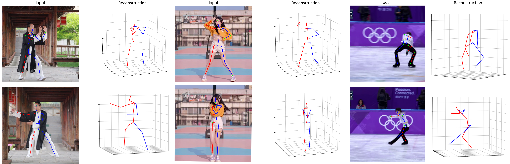

# Learning Pyramid-structured Long-range Dependencies for 3D Human Pose Estimation [TMM 2025]

> [paper](https://ieeexplore.ieee.org/abstract/document/10858746) and [arxiv](http://arxiv.org/abs/2506.02853)
> Explores long-range dependencies in hierarchical human body, an efficient single-frame monocular 3D human pose estimation method. 



## Dataset

The PGFormer code for data preparation is borrowed from [VideoPose3D](https://github.com/facebookresearch/VideoPose3D). The DiffPyramid code for GMM format data preparation is borrowed from [DiffPose](https://github.com/GONGJIA0208/Diffpose).

```
├─GT_PGFormer_16pt/data
│ └─data_2d_h36m_gt.npz
│ └─data_3d_h36m.npz
├─CPN_PGFormer_17pt/dataset
│ └─data_2d_h36m_cpn_ft_h36m_dbb.npz
│ └─data_3d_h36m.npz
├─DiffPyramid/dataset
│ └─data_3d_h36m.npz
│ └─data_2d_h36m_cpn_ft_h36m_dbb_gmm.npz
│ └─data_2d_h36m_gt_gmm.npz
```

#### Quickstart

We recommend constructing the Pytorch runtime environment by referring to the baselines ([SemGCN](https://github.com/garyzhao/SemGCN),[MGCN](https://github.com/ZhimingZo/Modulated-GCN),[MHFormer](https://github.com/Vegetebird/MHFormer),[DiffPose](https://github.com/GONGJIA0208/Diffpose)) of each part. PGFormer code has been tested and runs well under both Linux and Windows. DiffPyramid code has been tested and runs well under Linux.

## Pretrained model

You can download pretained model [here](https://drive.google.com/drive/folders/1DspzL3GWH2nJ_4aGFHnlcPN9N1bLxzum?usp=sharing).

## Test

```
cd GT_PGFormer_16pt
python main_PGFormer.py --evaluate checkpoint\ckpt_best_34.2.pth.tar
```

```
cd CPN_PGFormer_17pt
CUDA_VISIBLE_DEVICES=4 python main.py --test --previous_dir checkpoint\model.pth
```

```
 CUDA_VISIBLE_DEVICES=0 python main_diffpose_frame.py \
 --config human36m_diffpose_uvxyz_gt.yml --batch_size 1024 \
 --model_pose_path checkpoints/ckpt_gt_posemodel.pth \
 --model_diff_path checkpoints/ckpt_gt_diffmodel.pth \
 --doc t_human36m_diffpose_uvxyz_cpn --exp exp
```

```
CUDA_VISIBLE_DEVICES=0 python main_diffpose_frame.py \
--config human36m_diffpose_uvxyz_cpn.yml --batch_size 1024 \
--model_pose_path checkpoints/gcn_xyz_cpn.pth \
--model_diff_path checkpoints/ckpt_cpn_diffmodel.pth \
--doc t_human36m_diffpose_uvxyz_cpn --exp exp
```

## Train

```
cd GT_PGFormer_16pt
python main_PGFormer.py
```

```
cd CPN_PGFormer
python main.py
```

```
CUDA_VISIBLE_DEVICES=0 python main_diffpose_frame.py --train \
--config human36m_diffpose_uvxyz_cpn.yml --batch_size 1024 \
--model_pose_path checkpoints/gcn_xyz_cpn.pth \
--doc human36m_diffpose_uvxyz_cpn --exp exp --ni \
>exp/human36m_diffpose_uvxyz_cpn.out 2>&1 & 
```

```
CUDA_VISIBLE_DEVICES=0 python main_diffpose_frame.py --train \
--config human36m_diffpose_uvxyz_gt.yml --batch_size 1024 \
--model_pose_path checkpoints/ckpt_gt_posemodel.pth \
--doc human36m_diffpose_uvxyz_gt --exp exp --ni \
>exp/human36m_diffpose_uvxyz_gt.out 2>&1 & 
```

## Citation

If you find our work useful in your research, please consider citing:

```
@article{wei2025learning,
  title={Learning Pyramid-structured Long-range Dependencies for 3D Human Pose Estimation},
  author={Wei, Mingjie and Xie, Xuemei and Zhong, Yutong and Shi, Guangming},
  journal={IEEE Transactions on Multimedia},
  year={2025},
  publisher={IEEE}
}
```

###### Else

1.We recommend following the PGFormer because the data processing and code are more convenient to use.

2.We recommend constructing the demo by referring to [MHFormer](https://github.com/Vegetebird/MHFormer), and you can achieve it by replacing the PGFormer model.

3.Abalation Experiments codes has been placed under Model 16pt. The DiffPyramid test_num_diffusion_timesteps in config can be adjusted to balance different performances.

4.For the first stage of the CPN pre-trained model of DiffPyramid, we directly used the [baseline diffpose]([GitHub - GONGJIA0208/Diffpose: [CVPR 2023] DiffPose: Toward More Reliable 3D Pose Estimation](https://github.com/GONGJIA0208/Diffpose)) model because the pre-trained model we reproduced was difficult to achieve better performance. 

5.**News**:Now we are committed to better motion generation to obtain 3D human poses. Welcome to keep following our new work.
